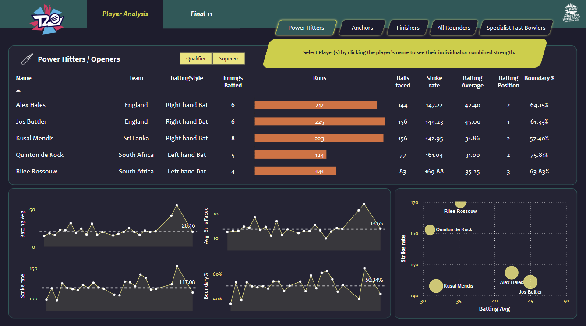
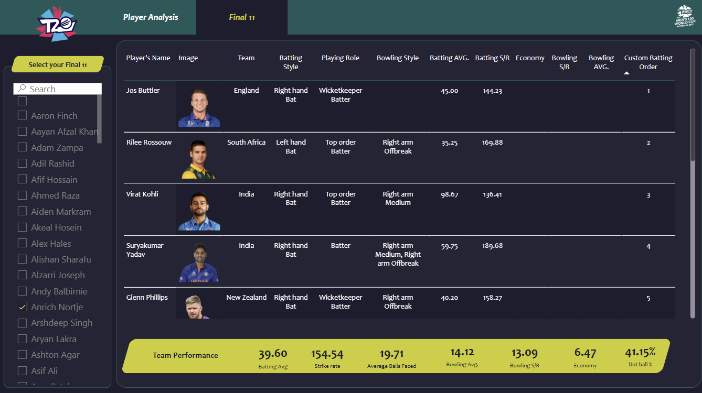

# Cricket Team Analyzer: T20 World Cup 2022  

## Dashboard Image



## 🏏 Project Overview  
This project aims to build an optimal T20 cricket team for the **2022 World Cup** using data analytics. The team is designed to meet two goals:  
1. **Score ≥180 runs on average**  
2. **Defend ≤150 runs on average**  

Players are categorized into five roles with specific performance criteria:  
| Role                     | Key Parameters                                                                 |  
|--------------------------|--------------------------------------------------------------------------------|  
| **Openers**              | Batting Avg >30, Strike Rate >140, Boundary % >50, Position <4                |  
| **Middle Order/Anchors** | Batting Avg >40, Strike Rate >125, Avg Balls Faced >20                        |  
| **Finishers**            | Batting Avg >25, Strike Rate >130, Innings Bowled >1                          |  
| **All-Rounders**         | Batting Avg >15, Strike Rate >140, Bowling Economy <7, Bowling Strike Rate <20|  
| **Specialist Bowlers**   | Economy <7, Dot Ball % >40, Bowling Style = "Fast"                            |  


## 🚀 Key Features  
- **Data Preprocessing**: Cleaned raw JSON data (ESPN Cricinfo) into structured CSVs using Python and SQL.  
- **Interactive Dashboard**: Power BI visualizations including scatter plots, heatmaps, and slicers.  
- **Role-Based Filtering**: Applied role-specific criteria to shortlist players.  
- **Team Validation**: Metrics to ensure the final team meets scoring/defending targets.  


## ⚙️ Methodology

1. **Data Collection**: Fetched match results, batting, and bowling stats from ESPN Cricinfo.
2. **Data Preparation**:  
   - Converted raw JSON data to CSV using numpy and pandas.
   - Removed irrelevant columns (e.g., player birthdates).  
   - Standardized IDs for players/matches.  
   - Created 3 key datasets: 
	   - `Batting Summary`  (Contains batting attributes such as: strike rate, boundaries, runs(0s, 1s, 4s, 6s), etc).
		- `Bowling Summary`  (Contains bowling attributes such as: wickets, economy, dot balls, etc).
		- `Match Results`  (Contains bowling attributes such as: team scores, venues, dates).
   - Filter players with ≥6 innings using SQL:  
     ```sql
     SELECT * FROM players WHERE innings_batted >= 6;  
     ```  
3.  **Criteria Application**:
    -   Flagged players meeting role-specific thresholds (e.g., Openers with Strike Rate >140).
4. **Import into Power BI**:  
   - Load preprocessed CSVs into Power BI.  
   - Use Power Query to add calculated columns (e.g., `Dot Ball % = (Dot Balls / Total Balls) * 100`).
   - Built dynamic charts to highlight top performers.

5. **Dashboard Navigation**:  
   - Use slicers to filter players by role, country, or performance metrics.  
   - Compare players via scatter plots (e.g., Strike Rate vs. Batting Average).  
6. **Team Assembly**:  
   - Drag-and-drop players into the **Team Builder Panel** based on role requirements.  
   - Validate team performance against targets using the **Metrics Panel**.  

## 📈 Results  
- **Final Team Metrics**:  
  - Average Runs Scored: **185**  
  - Average Runs Defended: **148**  
- **Top Performers**: Identified using SQL-backed metrics and Power BI slicers.  



## 🛠 Technologies Used  
- **Data Processing**: Python (`pandas`, `numpy`), SQL  
- **Visualization**: Power BI (DAX, Power Query)  
- **Data Storage**: CSV files  

## 📂 Data Sources  
- **Primary Source**: [ESPN Cricinfo](https://www.espncricinfo.com/)  